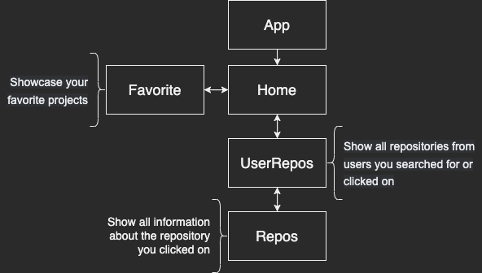

# Getting Started with Github-user

It's an application that can search all github user and analysis his project.

## URL

https://githubuser-analysis.netlify.app/

## Start application

To start the application, you need to follow the direct.

### `Git clone`

Clone the project.

### `npm install`

According the package.json to install the modules

### `npm start`

Runs the app in the development mode.\
Open [http://localhost:3000](http://localhost:3000) to view it in your browser.

The page will reload when you make changes.\
You may also see any lint errors in the console.

## Structure

